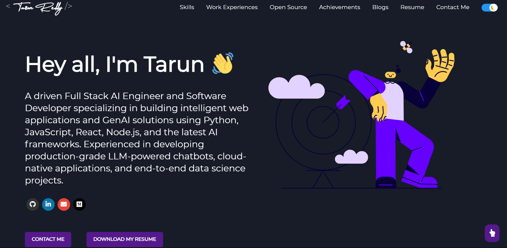

# 🧠 Tarun Reddy – Personal Portfolio

Welcome to my personal portfolio – a showcase of my work as a Full-Stack AI Engineer, with projects spanning machine learning, generative AI, NLP, and web development.

> 🔗 **Live Site**: [https://TarunReddy77.github.io/portfolio](https://TarunReddy77.github.io/portfolio)

---

## 🚀 What This Is

This portfolio highlights:

- 🌐 My latest projects in GenAI, LLMs, computer vision, and software engineering
- 📄 A curated resume and professional background
- 💬 Interactive contact features for networking and hiring

Designed to be **clean**, **fast**, and **mobile-responsive**.

---

## 🛠️ Tech Stack

- **Frontend**: React, SCSS, HTML5, JavaScript (ES6+)
- **Build Tools**: React Scripts, GitHub Pages
- **Animations**: Lottie, React Reveal
- **Version Control**: Git, GitHub
- **Design Philosophy**: Minimalist, developer-focused, mobile-first

---

## 📸 Preview

<!-- Add a real screenshot in your repo at /assets/portfolio-screenshot.png -->

---

## 📫 Contact Me

Feel free to reach out via:

- 📧 Email: [tarutornado@gmail.com](mailto:tarutornado@gmail.com)
- 💼 [LinkedIn](https://linkedin.com/in/tarun-reddy)
- 🌐 [Portfolio](https://TarunReddy77.github.io/portfolio)

---

## ⭐️ Show Your Support

If you found this portfolio inspiring or useful, feel free to give it a ⭐️ or fork it!
